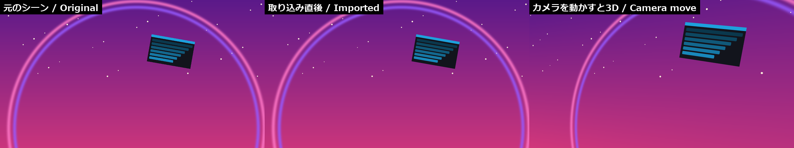
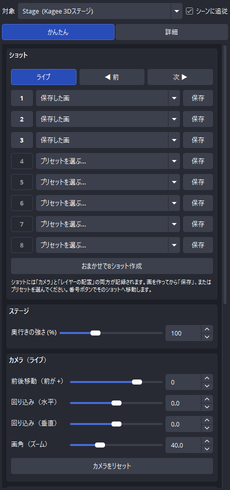
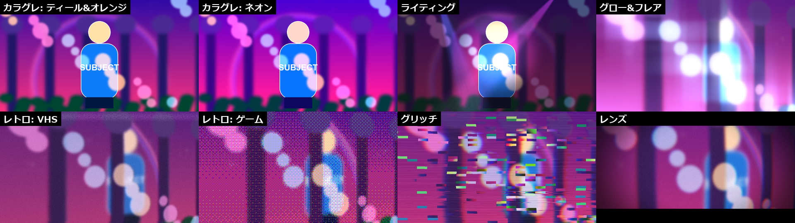

# Kagee — OBS Studio 用 3Dステージ & シネマティックエフェクト

[English](#english)

OBS のシーンを **奥行きのある3D空間** に変えて、仮想カメラでカメラワーク・ライティング・カラーグレーディング・画面エフェクトを付けて「撮影」できる OBS Studio プラグインです。
キャプチャ・録画・配信は OBS がそのまま担当するので、いつもの配信・録画の流れに組み込めます。



## 動作環境

- Windows 10 / 11（64bit）
- **OBS Studio 32.2 以降**

## インストール（かんたん）

1. [Releases](https://github.com/852wa/KAGEE/releases) から最新の **`Kagee-x.y.z-windows-x64-setup.exe`** をダウンロード
2. OBS Studio を終了してから、ダウンロードしたファイルをダブルクリック
   - 「Windows によって PC が保護されました」と表示されたら「詳細情報」→「実行」
   - 「このアプリがデバイスに変更を加えることを許可しますか？」は「はい」
3. 「次へ」で進めて完了。OBS Studio を起動し、メニュー **「ドック」→「Kagee」** でパネルを表示

インストーラーを使いたくない場合は **`Kagee-x.y.z-windows-x64.zip`** を展開し、中の **`install.bat`** をダブルクリックしてください。

## 使い方（最短 3 ステップ）

1. 3Dにしたいシーンの **一番上** に「**Kagee 3Dステージ**」を追加（ソース → ＋）
2. Kagee パネルの「**このシーンのアイテムをレイヤーとして取り込む**」を押す
3. 「**おまかせで8ショット作成**」を押し、番号ボタンでショットを切り替える

立体感は「奥行きの強さ」、色は「色のルック」で調整できます。細かく作り込みたいときはパネルを「詳細」モードに切り替えてください。



## 主な機能



| 種類 | 名前 | できること |
|---|---|---|
| ソース | **Kagee 3Dステージ** | 最大8レイヤーを奥行き付きで配置し、仮想カメラで撮影。シーンからワンクリック取り込み、被写界深度（自動背景ブラー）、端が見えない自動拡大 |
| ソース | **Kagee 調整レイヤー** | 付けたフィルターが「シーン内でこれより下」のレイヤーだけにかかる（テロップやロゴは除外できる） |
| フィルター | カラーグレーディング | ルックプリセット10種、露出・色温度・コントラスト・彩度など、リフト/ガンマ/ゲイン、色調、.cube LUT の読み込みと書き出し、ビフォー/アフター比較 |
| フィルター | ライティング | 環境光（暗さ）＋ライト4灯（スポット / ビーム / リムライト）、首振り・明滅・BPM連動 |
| フィルター | レンズ | 歪み、色収差、シャープ、フィルムグレイン、ビネット、シネマ帯 |
| フィルター | レトロ | VHS、ブラウン管、8mmフィルム、ビデオゲーム（ディザ）、LEDパネル、網点 |
| フィルター | グロー & フレア | ブルーム、アナモルフィックストリーク、クロス / スター |
| フィルター | ブラー | ガウシアン、絞り、ティルトシフト、方向、ズーム / 回転 |
| フィルター | グリッチ | RGB分離、ブロックずれ、ライン裂け、ゆらぎ。ホットキー / BPM でバースト |
| フィルター | モーショントレイル | 残像（ゴースト / エコー / 比較（明） / 加算）、コマ落ち風のフレームレート制限 |

**ショット**: 「カメラ」と「レイヤーの配置」をまとめて最大8個保存し、なめらかに切り替え。カメラプリセット12種（正面・寄り・引き・左右から・ロー/ハイアングル・ダッチ・横移動・望遠・広角・ドラマチック）。
**カメラの動き**: 手持ち揺れ、ゆっくりした自動の動き、ビートに合わせたズーム、インパクト揺れ、フラッシュ、BPM / タップテンポでの自動切替。
**ホットキー**: OBS の「設定 → ホットキー」でショット切替などを割り当て可能（外部コントローラーや obs-websocket からも操作できます）。
**マウス操作**: ステージを右クリック →「対話」で、ドラッグ・ホイールによるカメラ操作。

## よくある質問

- **パネルが見つからない** — メニュー「ドック」→「Kagee」にチェックを入れてください。
- **何も表示されない** — ステージにまだレイヤーがありません。パネルの「このシーンのアイテムをレイヤーとして取り込む」を押してください。
- **ショット 1 と 2 が同じになる** — ショットは「保存を押した時点の画」を記録します。画を変えてから次の番号の「保存」を押してください。
- **プラグインが読み込まれない** — OBS Studio のバージョンが 32.2 以降か確認してください（ヘルプ → OBS Studio について）。

## アンインストール

Windows の「設定 → アプリ」から **Kagee** をアンインストールします（zip 版の場合は `uninstall.bat`）。

## 開発者向け

必要なもの: Visual Studio 2022（C++ によるデスクトップ開発）、CMake 3.24 以降、Git、Inno Setup 6（インストーラーを作る場合のみ）

```bash
powershell -ExecutionPolicy Bypass -File tools/fetch-deps.ps1
cmake -S . -B build -G "Visual Studio 17 2022" -A x64
cmake --build build --config Release
powershell -ExecutionPolicy Bypass -File tools/package.ps1
```

- `tools/fetch-deps.ps1` が OBS のヘッダーと、OBS に同梱されているものと同じ Qt パッケージ（ハッシュ検証付き）を `.deps/` に取得します。
- OBS の各 DLL 用インポートライブラリは `sdk/lib/*.def` から生成されます（OBS 本体のビルドは不要）。
- `tools/package.ps1` で `dist/` にインストーラーと zip を作成します。`v*` タグを push すると GitHub Actions がリリースの下書きを作成します。
- `test/` には、ポータブル版 OBS を obs-websocket で操作して描画と動作を検証するスクリプトがあります（`test/redeploy.ps1` → `python test/run_*.py`）。

## ライセンス

[MIT License](LICENSE) © 2026 hakoniwa

---

## English

**Kagee** turns an OBS scene into a 3D space and lets you film it with a virtual camera — camera moves, lighting, color grading and cinematic screen effects — right inside OBS Studio.

**Requirements:** Windows 10/11 (64-bit), **OBS Studio 32.2 or later**.

**Install:** download `Kagee-x.y.z-windows-x64-setup.exe` from [Releases](https://github.com/852wa/KAGEE/releases), close OBS, run it, then open the panel from **Docks → Kagee**. (Alternatively unzip `Kagee-x.y.z-windows-x64.zip` and double-click `install.bat`.)

**Quick start:**
1. Add **Kagee 3D Stage** at the **top** of the scene you want in 3D.
2. In the Kagee panel press **Import this scene's items as layers**.
3. Press **Create 8 varied shots automatically** and switch shots with the number buttons.

**Features:** 3D multiplane stage with a virtual camera, shots that store camera + layer layout (12 camera presets), depth of field, adjustment layer, color grading (10 looks, .cube LUT import/export), lighting (spot / beam / rim), lens, retro (VHS/CRT/film/game/LED/halftone), glow & flares, blur, glitch and motion-trail filters, hotkeys, BPM / tap-tempo automation, and a dockable panel with Easy and Detailed modes (Japanese and English UI).

**Uninstall:** Windows Settings → Apps → Kagee.

**Build:** see the developer section above (`tools/fetch-deps.ps1`, CMake, `tools/package.ps1`).

**License:** [MIT](LICENSE) © 2026 hakoniwa
